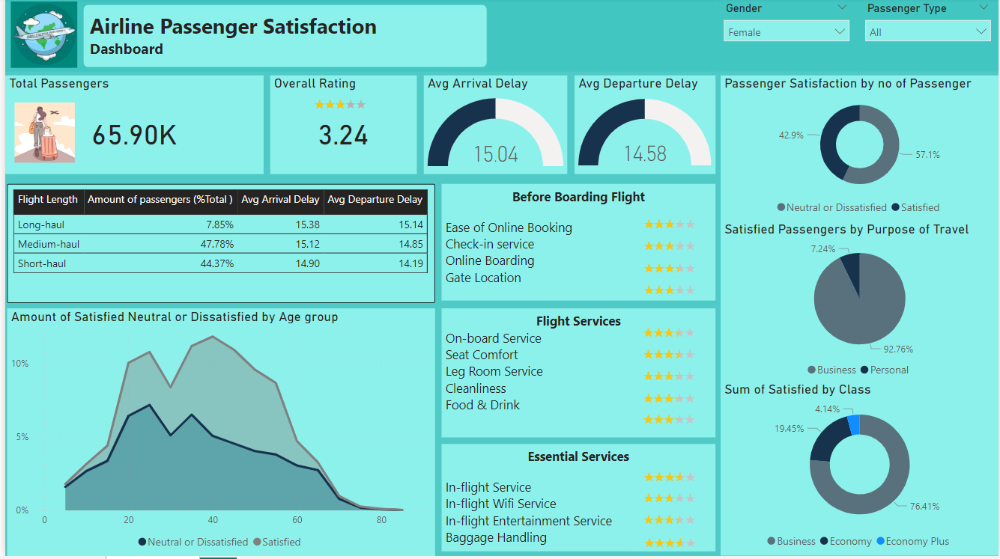

# Maven Airlines Passenger Satisfaction Analysis

## Challenge Objective

As a Senior Data Analyst for Maven Airlines, your task is to analyze the latest passenger survey data to identify key areas for improvement. The satisfaction rate has dipped below 50% for the first time ever, and the leadership team needs a data-driven strategy to increase this rate. Your goal is to recommend actionable strategies based on your analysis and present your findings in a single-page report or dashboard.

## Project Overview

This project aims to provide a comprehensive overview of passenger satisfaction with Maven Airlines. The dashboard includes key metrics such as the total number of passengers, average flight distance, and average arrival and departure delays. It also offers insights into various factors affecting passenger satisfaction, including class, customer type, travel type, food and drink options, onboard service, gender, cleanliness, check-in service, and seat comfort. By analyzing these factors, the dashboard helps identify areas for improvement to enhance the overall passenger experience.

## About the Dataset

The dataset contains satisfaction ratings from over 120,000 airline passengers, along with additional details about each passenger's flight, travel type, and evaluations of various factors such as cleanliness, comfort, service, and overall experience.

## Recommended Analysis

The analysis aims to address the following questions:
1. What is the percentage of satisfied airline passengers, and does it differ by customer type or type of travel?
2. What are the characteristics of a frequent airline passenger's customer profile?
3. Does flight distance impact customer preferences or travel behavior?
4. Which factors have the most significant impact on customer satisfaction, and which ones lead to dissatisfaction?

## ETL and Data Modeling

To prepare the dataset for analysis:
- Loaded the dataset containing over 120,000 passenger ratings.
- Used Power Query to clean the data and eliminate unnecessary columns, streamlining it for analysis in Power BI.

## Insights

### General Insights
- Among 129,880 passengers, only 44% expressed satisfaction with the airline's services.
  
### Returning Customers
- Commonly middle-aged (40-59) individuals.
- Typically take medium-leg flights (932 to 2485 miles) for business purposes.
- Prefer to travel in business class.
- Overall satisfaction score: 71%.
- Areas for improvement: in-flight Wi-Fi, online booking, gate location.

### Short-leg Flight Passengers
- 54% of passengers (70,678 individuals) opt for short-leg flights (up to 932 miles).
- Predominantly young adults (20-39) and middle-aged individuals (40-59), with an average age of 39.
- Travel mostly in economy class.
- Overall satisfaction score: 63%.
- Areas for improvement: in-flight Wi-Fi service, entertainment, cleanliness, online booking, gate location, online boarding.

## Recommendations

Based on these findings, it is advisable for Maven Airlines to focus on improving the identified areas to enhance the travel experience for passengers, particularly in:
- In-flight Wi-Fi service.
- Online booking and gate location.
- Entertainment options.
- Cleanliness of the aircraft.
- Online boarding process.

## Dashboard

[View Live Dashboard](https://link-to-your-live-dashboard.com)

## Contact

For further information or queries, feel free to reach out via [email@example.com](sakshithakare554@gmail.com) or connect on [LinkedIn](www.linkedin.com/in/sakshi-thakare9404).

Thank you for reviewing this project!
